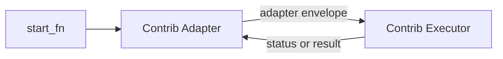
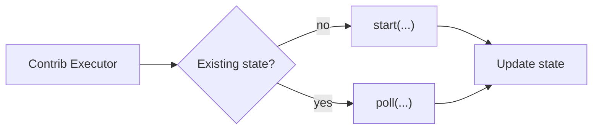

# Contrib Runtime Contract

## Authority

This document is authoritative for contrib runtime role boundaries, shared adapter/executor lifecycle contracts, and contrib supervisor payload/behavior.

## Scope

This document does not define:

- the core adapter-boundary payload or output schema; refer to [../adapter-execution-contract.md](../adapter-execution-contract.md),
- state-record field shape or backend serialization details; refer to [executor-state.md](executor-state.md),
- live execution-graph schema or cancel or sweep graph propagation; refer to [execution-graph.md](execution-graph.md),
- per-executor kwargs schemas or executor-specific runtime details beyond shared lifecycle requirements; refer to [executor-catalog.md](executor-catalog.md).

## Glossary

- Adapter Boundary: the runtime boundary defined by [../adapter-execution-contract.md](../adapter-execution-contract.md) where `runnable.adapter` is invoked with adapter payload and returns canonical adapter output.
- Contrib Adapter: the contrib executable/CLI ingress surface named by `runnable.adapter` for a contrib execution surface.
- Contrib Executor: the contrib runtime component selected by a contrib adapter to perform execution behavior for a contrib execution surface.
- Contrib Adapter/Executor Pair: the selected contrib adapter together with the selected contrib executor for one contrib execution surface invocation.
- Execution Surface: the contrib runtime path associated with one contrib adapter and one selected contrib executor for a given runnable invocation.
- Parent Comms: optional adapter-payload comms describing where the current adapter invocation reports status/heartbeat/result for its caller.
- Supervisor: the optional contrib runtime harness helper exposed by `daggerml.contrib.supervisor`.

## Contract

### Interfaces

- Contrib adapter/executor composition:
  - for a contrib execution surface, the Contrib Adapter/Executor Pair MUST satisfy the core adapter contract at the Adapter Boundary,
  - a Contrib Adapter class intentionally implements only the adapter-side portion of that contract,
  - a Contrib Executor intentionally implements the execution-side portion of that contract,
  - execution-side behavior includes executor lifecycle handling, state transitions, and sub-runnable invocation,
  - `runnable.adapter` MUST identify the Contrib Adapter ingress surface, not the executor.
- Required contrib adapter class surface:
  - `name`: adapter id string,
  - `send(*, runnable, argv_ptr, cache_key, remote)`: one-step runtime dispatch entrypoint over parsed adapter inputs,
  - `resolve_runnable(uri, kwargs, sub)`: adapter-side runnable lowering/normalization entrypoint,
  - `cli(argv)`: CLI transport entrypoint for the adapter executable,
  - `cli(argv)` MUST parse adapter-boundary payload input into `send(...)` arguments,
  - `cli(argv)` MUST extract Parent Comms from the payload before calling `send(...)`,
  - `cli(argv)` MUST support a polling mode that repeatedly calls `send(...)` until terminal when requested by adapter-specific CLI flags,
  - `send(...)` MUST perform one bounded runtime step for the current invocation,
  - when payload includes Parent Comms, `cli(argv)` MAY report the current invocation's state to that parent comms backend before returning,
  - adapter-side runtime behavior MUST route the invocation to a selected Contrib Executor for the execution surface,
  - adapter-side runtime behavior MUST preserve Adapter Boundary payload fields required by the selected execution surface,
  - unless a more specific contrib contract says otherwise, unexpected contrib adapter-local fields are invalid.
- Built-in contrib adapters:
  - `local` (`dml-local-adapter`) MUST select an executor for the current runnable target and perform one bounded runtime lifecycle step,
  - `lambda` (`dml-lambda-adapter`) MUST forward the runtime payload to the configured Lambda function and return canonical adapter output.
- Required contrib executor class surface:
  - `name`: executor id string,
  - `adapter`: adapter id string for the contrib adapter surface this executor serves,
  - `state_class`: state backend class exposing `lock(cache_key)` as a contextmanager,
  - `resolve_runnable(uri, kwargs, sub)`: executor runnable lowering/validation entrypoint,
  - `start(*, runnable, argv_ptr, cache_key, remote, state=None)`,
  - `poll(*, state=None)`,
  - `gc(*, state=None)`.
- Shared contrib executor lifecycle interface:
  - runtime coordination MUST read current state and dispatch to `start` or `poll`,
  - stateful executors MUST resume existing execution state for the same `cache_key` and MUST NOT relaunch duplicate jobs,
  - stateless executors MAY perform execution entirely inside `start(...)` and MAY ignore `cache_key` for local executor-owned deduplication,
  - when an executor is stateless, repeated invocations MAY re-run the executor transport step and any deduplication semantics are owned by the nested adapter or remote runtime rather than by executor-local state,
  - terminal states from stateful executors MUST be returned without relaunch,
  - kickoff/poll invocations MUST be bounded,
  - stateful long-running work MUST be backgrounded and resumed by polling,
  - polling MUST be idempotent across repeated invocations for stateful executors,
  - stateless executors MAY define `poll` and `gc` as no-op lifecycle hooks when they retain no executor-owned handle or state,
  - state locking MUST be backend-owned via `state_class.lock(cache_key)`,
  - `gc(*, state)` MUST be idempotent and MUST clean up executor-owned residue that may remain after terminal execution or cancellation,
  - only the executor/runtime owner of a given live execution backend may call `gc(*, state)` for that node,
  - observing that another execution has reached a terminal state does not by itself authorize the observer to delete that node's live state row,
  - executors that are stateless in normal operation MUST NOT invent synthetic executor-owned state solely to emulate resumability.
- Shared state/comms handling interface:
  - executors MUST own runtime state ownership decisions for their execution surface,
  - executors that create new state records MUST initialize canonical state records via executor-state APIs,
  - executors MAY write executor-specific metadata only through namespaced state metadata owned by the executor,
  - in runtimes that implement the execution graph defined by [execution-graph.md](execution-graph.md), adapters and executors MUST preserve the caller-identity inputs needed by that graph contract,
  - executors that create nested child execution state MUST create an executor-private child state backend or directory distinct from the parent execution state backend,
  - nested child state backends created by an executor are owned by that executor for cleanup and row deletion,
  - parent comms is observational and MUST NOT be treated as the child execution's canonical mutable state backend,
  - sub-runnable invocation within contrib runtime MUST be execution-side behavior owned by the executor portion of the Contrib Adapter/Executor Pair,
  - executors MUST NOT receive parent comms as lifecycle parameters.
  - payload `comms` is adapter-owned Parent Comms for the current invocation,
  - adapters interpret Parent Comms; executors do not,
  - Parent Comms identifies a parent-observation State backend and MUST be treated as immutable invocation input,
  - `send(...)` MUST NOT depend on Parent Comms for the current invocation's own state ownership,
  - adapters that honor Parent Comms MUST update that parent-observation State backend from the current invocation's own state just before returning from `cli(...)`,
  - adapters MAY reject or ignore Parent Comms when the selected adapter surface cannot communicate with that backend,
  - executors MAY construct nested adapter payloads that include `comms`; for the nested adapter invocation, that `comms` is again Parent Comms for the adapter receiving that payload,
  - `comms` attachment is limited to one hop: an adapter or executor MAY attach `comms` only to the immediate child adapter payload it creates,
  - a child adapter that receives payload `comms` MUST consume/report through that Parent Comms backend for its own invocation,
  - a child adapter MUST NOT propagate, forward, or rewrite that `comms` for a grandchild invocation.
- Result publication interface:
  - the Contrib Adapter/Executor Pair MUST publish the result DAG cache entry before returning `succeeded`,
  - `cache_key` is a deduplication/correlation helper and MUST NOT override canonical argv-derived cache identity.
- Supervisor payload interface:
  - `Supervisor.run(payload)` MUST accept a strict payload object with these fields:
    - `version` (required): literal `1`,
    - `cache_key` (required): non-empty string,
    - `cmd` (required): non-empty `list[str]` with non-empty command elements,
    - `remote` (required): object with `root` (string) and `cache` (string),
    - `comms` (required): object with `kind` (string) and `spec` (object),
    - `env` (optional): `dict[str, str]`,
  - unknown top-level supervisor payload fields MUST be rejected,
  - `python -m daggerml.contrib.supervisor` MUST accept the same payload from stdin or a file path option and invoke `run(payload)`.
  - script-worker invocation is narrower than supervisor payload:
    - the supervisor launches `python -m daggerml.contrib.executors.script <argv_ptr>`,
    - the script worker entrypoint accepts only `argv_ptr`,
    - supervisor-owned environment setup is authoritative input for the script worker.

### Invariants

- For any contrib execution surface invocation, the Contrib Adapter/Executor Pair is the normative implementation unit for the core adapter contract.
- A Contrib Adapter class alone is not required to satisfy all execution-side semantics of the core adapter contract.
- A Contrib Executor alone is not an Adapter Boundary surface.
- Adapter routing and executor execution responsibilities MUST remain distinct:
  - adapters own ingress/egress and executor selection,
  - executors own execution behavior.
- Built-in executor definitions and executor-specific runtime behavior MUST remain consistent with [executor-catalog.md](executor-catalog.md).
- State-record shape, ownership fields, and backend-specific serialization MUST remain consistent with [executor-state.md](executor-state.md).
- Backward compatibility with legacy `commit_ptr`-based success payloads is not supported.

### Error Semantics

- Adapter routing failures:
  - non-retryable unless the failure is caused by a transient external dependency used during routing,
  - terminal for the current invocation,
  - caller behavior: treat as failed runtime dispatch for the selected contrib execution surface,
  - operator action: repair registration, payload construction, or adapter configuration.
- Executor lifecycle failures:
  - retryable only when the selected executor defines the failure as recoverable through repeated polling,
  - terminal when executor state reaches `failed` or `canceled`,
  - caller behavior: continue polling only while state remains non-terminal and the execution surface contract permits retry,
  - operator action: inspect executor-specific state metadata, logs, and supervisor outputs for the selected execution surface.
- State backend or locking failures:
  - retryable when caused by bounded contention or transient backend unavailability,
  - terminal when the backend cannot provide the required single-writer lifecycle guarantees,
  - caller behavior: do not relaunch duplicate work for the same `cache_key`; retry through the same execution surface only when the failure is transient,
  - operator action: restore backend availability or locking correctness.
- Supervisor payload validation failures:
  - non-retryable until payload shape is corrected,
  - terminal for that supervisor invocation,
  - caller behavior: correct the payload and retry with a new invocation,
  - operator action: treat as an implementation defect in the caller constructing supervisor payloads.

### Security Boundaries

None identified in this spec. Handled by generic execution environment assumptions.

### Observability

- While `Supervisor.run(payload)` is active, the supervisor MUST update running heartbeat state through executor-state APIs.
- Stateful contrib runtime implementations SHOULD preserve enough executor-owned metadata to identify execution ownership and runtime handles needed for polling, cancellation, cleanup, and debugging.
- Stateless contrib runtime implementations MAY leave executor-owned metadata empty when no runtime handle or resumable state exists.
- Parent Comms updates are observational only; canonical mutable execution data remains the current invocation's own State record.
- Parent Comms handling is a CLI/transport concern layered around `send(...)`, not an executor lifecycle concern.
- Runtime status/introspection surfaces for contrib plugin discovery and effective registrations are authoritative in [status.md](status.md).

### Authority Handoffs

- The core adapter-boundary payload schema, output schema, and generic adapter invocation rules are authoritative in [../adapter-execution-contract.md](../adapter-execution-contract.md).
- Live execution-graph schema, caller identity rules, and cancel or sweep semantics are authoritative in [execution-graph.md](execution-graph.md).
- State-record field shape, ownership fields, and backend reference behavior are authoritative in [executor-state.md](executor-state.md).
- Per-executor kwargs schemas and executor-specific runtime behavior are authoritative in [executor-catalog.md](executor-catalog.md).
- Contrib registry/discovery contracts are authoritative in [registries.md](registries.md).
- Contrib runtime diagnostics and status reporting are authoritative in [status.md](status.md).

## Compatibility

- Contrib runtime contracts in this document are stable for `status: specified` behavior.
- Supervisor payload versioning is explicit through `payload.version`; this document defines only version `1`.
- Supervisor payload handling is not forward-compatible with unknown top-level fields; unknown fields are rejected.
- Contrib runtime success semantics are not backward-compatible with legacy `commit_ptr`-returning adapter behavior.

## References

- [../adapter-execution-contract.md](../adapter-execution-contract.md)
- [execution-graph.md](execution-graph.md)
- [executor-state.md](executor-state.md)
- [executor-catalog.md](executor-catalog.md)
- [registries.md](registries.md)
- [status.md](status.md)
- [../errors.md](../errors.md)
