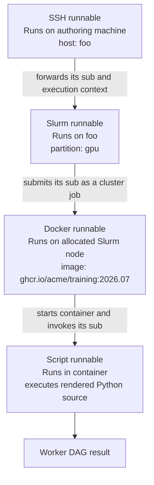

# Author a DAG

Authoring starts in the user's runtime: the mutable DAG returned by `dml.new(...)`. Stage values and functions there, call them to record work, and commit the final node.

## Use the runtime

Initialize the project first with `dml init`, then create a runtime in an authoring script:

```python
import daggerml as dml


with dml.new("analysis", message="summarize inputs") as dag:
    raw = dag.put([1, 2, 3], name="raw")
    summary = dag.put({"count": len(raw), "values": raw}, name="summary")

    assert dag["raw"] == raw
    assert dag.summary == summary
    dag.commit(summary)

print(dml.load("analysis").result.value())
```

`Dag.put()` stages a value and returns its node. Naming a node makes it available through `dag["name"]` or `dag.name`; the name is a label, not a copy. Call `.value()` to materialize a node's value. Use `dag.require("other-dag")` to import the committed result of another DAG.

## Author a funk

Use `@api.funkify` to package a Python function as a runnable funk:

```python
import daggerml as dml
from daggerml.contrib import api


@api.funkify
def square(dag, number):
    return number.value() ** 2


with dml.new("squares") as dag:
    _ = dag.call(square, 9, name="foo")
	# or alternatively
	dag.fn = square
	result = dag.fn(3, name="bar")
    dag.commit(result)
```

Funk arguments are node-like in the worker, so read input with `.value()`. Calling a staged funk records a function-call node. Script-backed funks execute in a separate worker and receive the function source, not module globals. The worker imports that source from `_daggerml_live.py` as module `_daggerml_live`, with normal Python module metadata. Import dependencies inside the function body or inject them explicitly.

The worker injects a DEBUG logger named `_daggerml_live`; code can use either `logger` or `logging.getLogger(__name__)`. Its records go to worker stderr for supervisor capture. This configuration is isolated to the live module and does not enable DEBUG output from third-party dependency loggers.

Use `extra_objs` to include helper definitions in the generated script, or `post_lines` to append source lines after those definitions:

```python
def clamp(value):
    return max(0, min(value, 1))


@api.funkify(extra_objs=(clamp,))
def normalize(dag, number):
    return clamp(number.value() / 100)
```

Script-backed execution uses remote artifacts; configure `remote.root` before running it. Test author code with `daggerml.contrib.testing.defunkify` when a full runtime is unnecessary.

## Choose an executor

Every `@api.funkify` creates a delayed runnable. Its `uri` selects an executor and its `adapter` selects the adapter that dispatches to that executor. The default, `@api.funkify(adapter="local", uri="script")`, renders and runs a Python script in a supervised subprocess. The script executor captures standard output and error, including conventional logging output, and provides the DML execution, cache, and remote context needed to run the script.

Use another executor when the script needs a different environment. For example, this wrapper runs a script locally in a fixed Docker image. The parameters are all ordinary, hard-coded Python values; use `api.ref` when a parameter instead comes from a node in the DAG.

```python
@api.funkify(
    adapter="local",
    uri="docker",
    image="ghcr.io/acme/forecast:2026.07",
    flags=["--cpus=4", "--memory=8g"],
)
@api.funkify  # defaults to: api.funkify(adapter="local", uri="script")
def score(dag, records):
    return {"count": len(records.value())}
```

The Docker runnable is the outer wrapper. It starts a container from the configured image, then asks the adapter in its script sub-runnable to run the rendered source there.

### Stack executor wrappers

Runnables are composable: each additional `@api.funkify` wraps the runnable produced by the decorator below it as its `sub`. This supports execution paths such as a Docker image submitted to a Slurm cluster through an SSH host that holds the cluster credentials.

The following is illustrative. This repository does not ship a Slurm executor or adapter; an installation would need a site plugin that registers `adapter="slurm"`, `uri="slurm"`, and the Slurm-specific parameters shown here.

```python
@api.funkify(
    uri="ssh",
    host="foo",
    flags=["-o", "BatchMode=yes"],
    env_files=["/etc/dml/slurm-credentials.env"],
)
@api.funkify(
    adapter="slurm",  # assuming a clustom Slurm adapter is registered
    uri="slurm",
    partition="gpu",
    account="research",
    time_limit="01:00:00",
)
@api.funkify(
    uri="docker",
    image="ghcr.io/acme/training:2026.07",
    flags=["--gpus", "all"],
)
@api.funkify
def train(dag, dataset):
    return {"rows": len(dataset.value())}
```



The SSH wrapper runs first on the authoring machine, connects to `foo`, sources its credentials file there, and invokes the Slurm adapter (assuming it's installed on the `foo` host) with the nested runnable. The Slurm wrapper submits its Docker sub-runnable to the selected partition. The Docker wrapper pulls and starts the image invokes the script sub-runnable inside it. Each wrapper consumes only its own configuration and forwards the nested runnable with all of the required execution info.

## Complex and nested funks

Consider a pipeline where `main` calls `preprocess`, and `preprocess` calls `parse_numbers` and `normalize`. With only `@api.funkify` as we've shown it, every function must receive the funks it calls:

```python
@api.funkify
def parse_numbers(dag, raw):
    return [int(value) for value in raw.value()]


@api.funkify
def normalize(dag, values):
    values = values.value()
    return [value / max(values) for value in values]


@api.funkify
def summarize(dag, values):
    values = values.value()
    return {"count": len(values), "total": sum(values)}


@api.funkify
def preprocess(dag, raw, parse_numbers_fn, normalize_fn):
    return normalize_fn(parse_numbers_fn(raw))


@api.funkify
def main(dag, raw, preprocess_fn, summarize_fn, parse_numbers_fn, normalize_fn):
    values = preprocess_fn(raw, parse_numbers_fn, normalize_fn)
    return summarize_fn(values)
```

The forwarding of values like `preprocess_fn` is necessary to avoid the footgun specified [here](../../sharp-bits-and-security.md#editable-dependency-changes-do-not-affect-a-funk-cache-key).

## Prepopulate named nodes

The script executor's `prepop` argument stages values under local names in the worker DAG before the script runs. Each value must be something `Dag.put()` can store. The direct funks below work because `@api.funkify` produces a delayed runnable, which DaggerML resolves into a storable runnable. A bare Python function or another custom object needs a codec before it can be used in `prepop`.

```python
@api.funkify(prepop={"parse_fn": parse_numbers, "norm_fn": normalize})
def preprocess(dag, raw):
    return dag.norm_fn(dag.parse_fn(raw))


@api.funkify(prepop={"proc_fn": preprocess, "sum_fn": summarize})
def main(dag, raw):
    return dag.sum_fn(dag.proc_fn(raw))


with dml.new("dataset-summary") as dag:
    dag.main = main
    dag.commit(dag.main(["2", "4", "8"]))
```

The functions now accept only the data they operate on. Staging `main` recursively resolves its delayed runnable values, so users don't have to pass in all the functions from the call stack. The `prepop` names are local to each worker DAG.

## Reference runtime values

Use `api.ref("name")` when a delayed value depends on a node produced while authoring the DAG, rather than on a value known when the funk is defined. It defers a named-node lookup until the containing value is staged, then resolves to `dag["name"]`. The named node must therefore already exist when that value is inserted.

The Docker dataset pipeline uses references for an image built earlier in the DAG and Docker flags created by the authoring environment:

```python
@api.funkify(uri="docker", image=api.ref("image"), flags=api.ref("dkr-flags"))
@api.funkify
def download_dataset(dag):
    from sklearn.datasets import load_iris

    return load_iris(as_frame=True).frame.dropna()
```

Then later in the DAG:

```python
dag.put(docker_flags, name="dkr-flags")
dag.put(docker_image, name="image")
dataset = dag.call(download, name="dataset")
```

When `download_dataset` is staged, its `image` and `flags` configuration values resolve to the already-named nodes. The full version, including the build context and model-training step, is in `examples/python/01-docker_dataset.py`.

## Use a dagclass

When the named declarations and `dag[...]` lookups become repetitive, use `@api.dagclass` to express the same composition with a Python class:

```python
@api.dagclass
class DatasetSummary:
    parse_numbers = parse_numbers
    normalize = normalize
    summarize = summarize

    def preprocess(self, raw):
        return self.normalize(self.parse_numbers(raw))

    def main(self, raw):
        return self.summarize(self.preprocess(raw))


api.run(DatasetSummary(), ["2", "4", "8"], name="dataset-summary")
```

- `@api.dagclass` collects named members and finds `self.<member>` dependencies.
- Dagclass methods use the same script `funkify` and `prepop` machinery as an explicit function.
- `api.run()` creates a DAG, stages members in dependency order, calls the entrypoint method (`main` by default), and commits its result.

Dagclass is a thin convenience wrapper, not a source normalizer. A dagclass method and an explicit `@api.funkify(prepop=...)` function share a cache when their user-authored function, configuration, and arguments are the same.

Instantiating a dagclass compiles it into a self-contained namespace. Constructor values and other evaluated attributes seed that namespace; methods are then compiled in dependency order and bind `self.<member>` references to those namespace values. A compiled method can therefore be staged in another DAG without requiring same-named nodes there, and caller nodes cannot shadow its dagclass attributes. `api.run()` executes the entrypoint compiled during instantiation; it does not compile the instance later.

Within a dagclass, every `api.ref("name")` is also local to the dagclass namespace. This includes references inside an externally defined `@api.funkify` value assigned as a dagclass attribute. Such a funk may reference only known dagclass attributes or members; instantiation fails if a reference cannot be resolved. Pass external configuration explicitly through constructor attributes rather than expecting a compiled dagclass member to capture a node from its caller DAG.

### Understand `self` inside dagclass methods

When a compiled method runs, its `self` argument is the worker's
`daggerml.api.Dag`, not the original Python class instance. Compilation uses
direct `self.<name>` syntax to build the member dependency topology:

- A non-reserved `self.<name>` load depends on the dagclass member `name`.
- Any assignment to the same `self.<name>` anywhere in the method removes that
  dependency. The assigned name does not need a class-level declaration.
- A remaining dependency whose name is not a dagclass member fails when the
  dagclass is instantiated.

Attribute assignment creates an invocation-local named node in the worker DAG:

```python
@api.dagclass
class PreparedSummary:
    summarize = summarize

    def main(self, raw):
        self.prepared = self.put([value.strip() for value in raw.value()])
        return self.summarize(self.prepared)
```

Here `summarize` is a compiled member dependency, while `prepared` is not. The
assignment does not mutate the original `PreparedSummary` instance, and a node
created by one method invocation is not automatically available in another
method invocation.

Some names are reserved because normal Python lookup on `Dag` resolves them
before named-node fallback can run:

```text
dml, token, ref, name, message, tags,
argv, result, keys, values,
put, require, call, commit, freeze, unfreeze, cancel
```

Reserved means only that `self.<name>` resolves to the `Dag` field, property, or
method. It does not mean every listed operation is useful inside a worker. A
dagclass cannot declare or assign a member with one of these names. `dag` is not
reserved and can be a normal dagclass member.

> **Sharp bit: assignments are syntactic.** Compilation does not evaluate
> ordering, reachability, branches, or loops. If any `self.output = ...` occurs
> anywhere in a method, `self.output` is excluded from dependencies for the
> entire method. The method must create that node before every runtime read. For
> example, this compiles without an `output` dependency but fails when `ready`
> is false:

```python
def main(self, raw, ready):
    if ready.value():
        self.output = raw
    return self.output
```

> **Sharp bit: item and dynamic access are invisible to compilation.** The
> compiler does not inspect `self["name"]`, `self["name"] = value`, `getattr`,
> `setattr`, aliases, or other dynamic forms. They add no topology edge and
> remove no edge, even when the item key is a string literal. Such expressions
> still execute with normal `Dag` runtime behavior, but dependency ordering and
> binding are the user's responsibility.

Dagclasses can also be composed as reusable functions:

```python
@api.dagclass
class MultiDatasetSummary:
    summarizer = DatasetSummary()

    def main(self, raw_dict):
        return {name: self.summarizer(raw) for name, raw in raw_dict.items()}


api.run(MultiDatasetSummary(), {"a": ["2", "4", "8"], "b": ["1", "3", "5"]})
```

The nested instance is a self-contained runnable: the parent DAG stages only `summarizer`, while its internal member graph remains part of that runnable's cache identity.

`api.load("dag-name")` is another delayed authoring value. When staged, it imports the committed result of `dag-name`, equivalent to `dag.require("dag-name")`.

See `examples/python/03-dagclass.py` for a runnable dagclass pipeline. For a
funkify-decorated dagclass method whose Docker configuration and method-body
dependencies share the dagclass namespace, see
`examples/python/04-docker-dagclass.py`.
